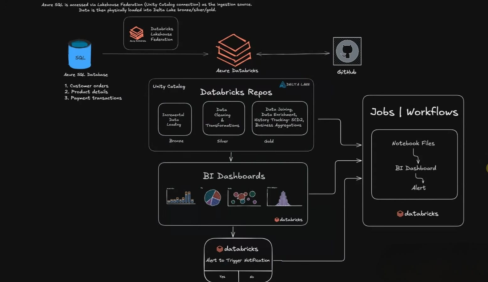
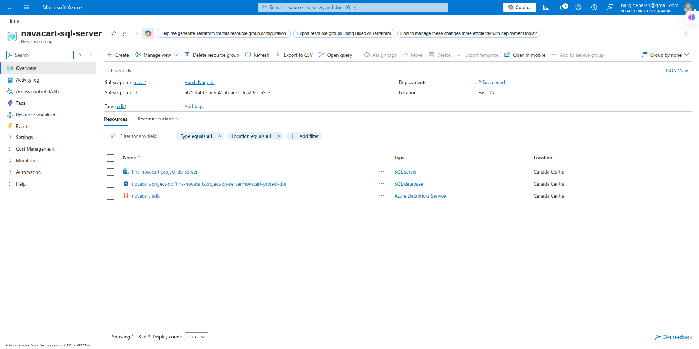
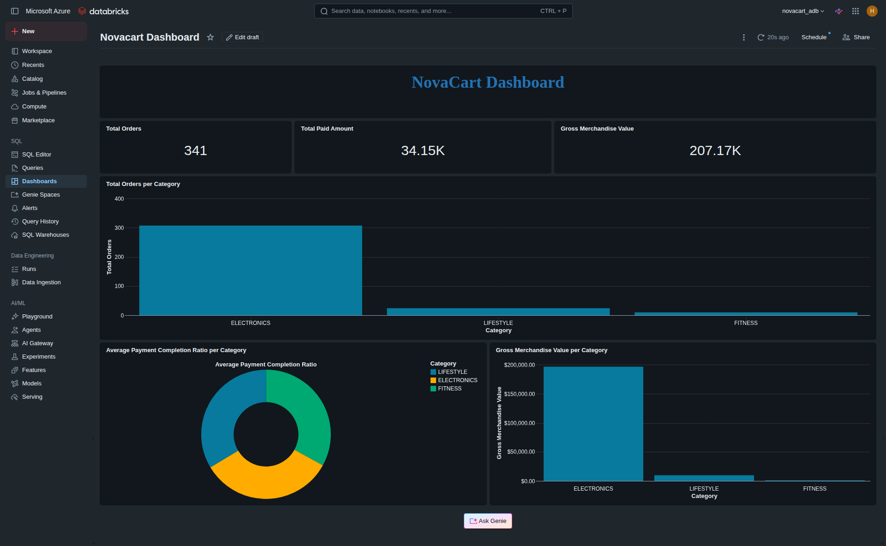
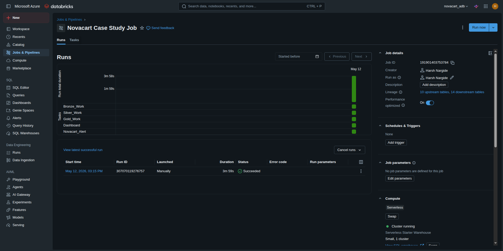
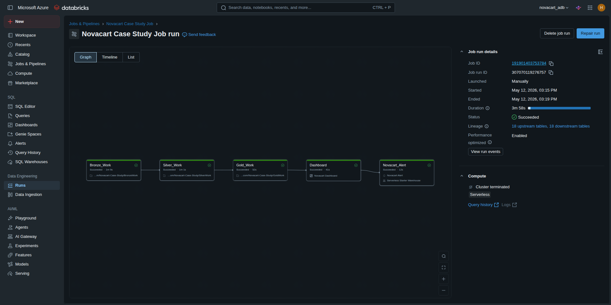
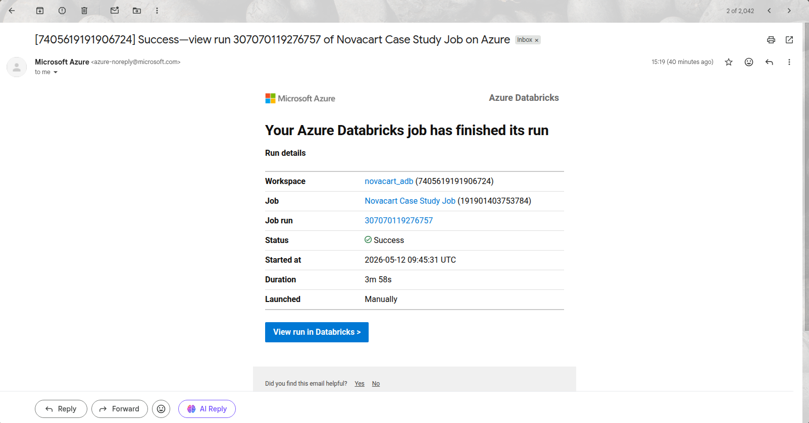
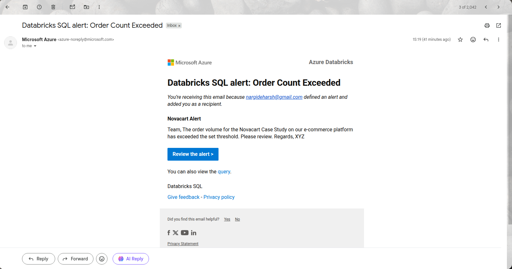

# Novacart E-Commerce Data Lakehouse Platform

## 📋 Project Overview

This project implements a modern **Medallion Architecture** data lakehouse platform for **Nova**, a fictitious e-commerce company, using **Azure Databricks** and **Delta Lake**. The solution addresses critical data challenges including operational bottlenecks, lack of historical tracking, and data quality inconsistencies by building a scalable, reliable analytics infrastructure.

The platform ingests transactional data from Azure SQL Database and processes it through structured Bronze, Silver, and Gold layers to deliver business-ready insights and support advanced analytics.

---

## 🎯 Business Problem

Nova faced several critical challenges with their existing data infrastructure:

- **Operational Bottlenecks**: Direct queries on production databases impacting performance
- **No Historical Tracking**: Inability to track changes in order status, product prices, and payment states over time
- **Data Quality Issues**: Inconsistent data formats, missing values, and invalid records
- **Scalability Concerns**: Manual data movement and lack of incremental processing capabilities
- **Limited Analytics**: Difficulty in generating business insights and KPIs

---

## 🏗️ Architecture Overview

### Core Architecture Components

The solution is built on **11 functional layers**:

1. **Source System**: Azure SQL Database with transactional data (orders, products, payments)
2. **Data Access Layer**: Lakehouse Federation via Unity Catalog for secure, governed access
3. **Processing Layer**: Azure Databricks with Apache Spark for distributed data processing
4. **Medallion Layers**: Bronze → Silver → Gold data transformation pipeline
5. **GitHub Integration**: Version control for notebooks and project artifacts
6. **Consumption Layer**: BI Dashboards and reporting interfaces
7. **Monitoring Layer**: Databricks Alerts for business metric thresholds
8. **Workflow Orchestration**: Databricks Jobs for pipeline automation



### Medallion Architecture

```
┌─────────────┐      ┌─────────────┐      ┌─────────────┐
│   BRONZE    │ ───> │   SILVER    │ ───> │    GOLD     │
│  Raw Data   │      │  Cleaned    │      │  Business   │
│  Ingestion  │      │  Validated  │      │  Analytics  │
└─────────────┘      └─────────────┘      └─────────────┘
```

---

## 📊 Data Pipeline Implementation

### 🥉 Bronze Layer (`BronzeWork.ipynb`)

**Purpose**: Raw data ingestion from source systems with full traceability

**Key Features**:
- **Incremental Loading**: Watermark-based ingestion using timestamp and primary key tracking
- **Control Table Management**: `ingestion_control` table tracks processing state
- **Metadata Enrichment**: Adds `bronze_ingested_at`, `bronze_run_id`, and `bronze_source_table` columns
- **Idempotency**: Prevents duplicate data ingestion through watermark comparison

**Tables Created**:
- `bronze_schema.orders_raw`
- `bronze_schema.products_raw`
- `bronze_schema.payments_raw`
- `bronze_schema.ingestion_control` (control table)

**Processing Logic**:
```python
# Watermark-based incremental loading
if last_successful_ts is None:
    rows_to_load = source_df  # Initial full load
else:
    rows_to_load = source_df.filter(
        (F.col(ts_col) > F.lit(last_successful_ts)) |
        ((F.col(ts_col) == F.lit(last_successful_ts)) &
         (F.col(pk_col) > F.lit(last_successful_pk)))
    )
```

**Key Metrics**:
- Tracks rows written per run
- Maintains last successful timestamp and primary key
- Generates unique run IDs for traceability

---

### 🥈 Silver Layer (`SilverWork.ipynb`)

**Purpose**: Data cleaning, standardization, validation, and quality management

**Key Features**:
- **Data Cleaning**: 
  - Standardizes text fields (uppercase, trim, regex replacements)
  - Handles currency formatting and numeric conversions
  - Manages null values and invalid data patterns
  
- **Deduplication**: Window functions to keep only the latest record per entity
  
- **Data Validation**: Business rule validation with quarantine mechanism
  
- **Quality Quarantine**: Invalid records moved to separate quarantine tables for review

**Tables Created**:

**Orders Processing**:
- `silver_schema.orders_cleaned` - Cleaned raw data
- `silver_schema.orders_transformed` - Validated, enriched data
- `silver_schema.orders_quarantine` - Invalid records

**Products Processing**:
- `silver_schema.products_cleaned`
- `silver_schema.products_transformed`
- `silver_schema.products_quarantine`

**Payments Processing**:
- `silver_schema.payments_cleaned`
- `silver_schema.payments_transformed`
- `silver_schema.payments_quarantine`

**Control Table**:
- `silver_schema.processing_control`

**Data Quality Rules**:

| Entity | Validation Rules |
|--------|-----------------|
| **Orders** | ✓ Customer ID not null<br>✓ Product ID not null<br>✓ Order status not empty<br>✓ Order amount > 0 |
| **Products** | ✓ Product name not null<br>✓ Category not null<br>✓ Price > 0 |
| **Payments** | ✓ Order ID not null<br>✓ Payment status not null<br>✓ Paid amount > 0 |

**Enrichment Features**:
- Date partitioning columns (year, month, day, day of week)
- Derived validation flags
- Standardized category names (e.g., "ELECTRNICS" → "ELECTRONICS")

---

### 🥇 Gold Layer (`GoldWork.ipynb`)

**Purpose**: Business-ready aggregations, KPIs, and historical tracking

**Key Features**:

#### 1. **Incremental Processing**
- Tracks changes across all Silver tables
- Identifies impacted orders through join propagation
- Processes only changed records for efficiency

#### 2. **Comprehensive Order Information**
- Joins orders, products, and payments
- Calculates payment completion ratios
- Derives payment states (Paid, Unpaid, Partially Paid, Overpaid)

#### 3. **SCD Type 2 Implementation**
- Manual implementation for historical tracking
- Tracks changes in order status, amounts, product details
- Maintains `valid_from_ts`, `valid_to_ts`, and `is_current` flags

#### 4. **Category Performance Analytics**
- Aggregates metrics by product category
- Calculates Gross Merchandise Value (GMV)
- Tracks payment completion and failure rates

#### 5. **Volume Snapshots**
- Publishes Parquet snapshots to Databricks Volumes
- Maintains both latest and historical snapshots
- Enables downstream consumption and auditing

**Tables Created**:
- `gold_schema.orders_information` - Current state of all orders
- `gold_schema.orders_information_scd2` - Historical tracking with SCD Type 2
- `gold_schema.category_performance` - Category-level KPIs
- `gold_schema.processing_control` - Gold layer control table

**Key Metrics Calculated**:

| Metric | Description |
|--------|-------------|
| **Payment Completion Ratio** | `paid_amount / order_amount` |
| **Payment State** | Categorized as Paid, Unpaid, Partially Paid, Overpaid |
| **Total Orders** | Count of distinct orders per category |
| **Gross Merchandise Value** | Sum of order amounts per category |
| **Total Paid Amount** | Sum of actual payments received |
| **Payment Failure Rate** | Percentage of failed payment transactions |

**SCD Type 2 Logic**:
```sql
-- Expire old records
MERGE INTO orders_information_scd2 AS t
USING gold_delta_view AS s
ON t.order_id = s.order_id AND t.is_current = true
WHEN MATCHED AND (attributes changed)
THEN UPDATE SET is_current = false, valid_to_ts = s.gold_update_ts

-- Insert new versions
INSERT INTO orders_information_scd2
SELECT *, gold_update_ts as valid_from_ts, null as valid_to_ts, true as is_current
FROM gold_delta_view
WHERE (new record OR attributes changed)
```

---

## 🔄 Incremental Processing Strategy

### Bronze Layer Watermarking
- Uses timestamp + primary key for precise tracking
- Handles millisecond precision for timestamps
- Prevents data loss during concurrent updates

### Silver Layer Incremental Logic
- Tracks `bronze_ingested_at` timestamp
- Processes only new Bronze records
- Maintains Silver run IDs for lineage

### Gold Layer Change Detection
- Identifies changed orders, products, and payments
- Propagates changes through joins
- Recalculates only impacted aggregations

**Benefits**:
- ✅ Prevents system crashes on large datasets
- ✅ Reduces processing time after initial load
- ✅ Enables near-real-time analytics
- ✅ Maintains data consistency

---

## 🛠️ Technology Stack

| Component | Technology |
|-----------|-----------|
| **Cloud Provider** | Microsoft Azure |
| **Data Platform** | Azure Databricks |
| **Storage Format** | Delta Lake |
| **Processing Engine** | Apache Spark (PySpark) |
| **Source Database** | Azure SQL Database |
| **Catalog** | Unity Catalog |
| **Version Control** | GitHub |
| **Languages** | Python (PySpark), SQL |
| **Orchestration** | Databricks Jobs |

---

## 📸 Visual Documentation

### Resource Group

*Azure resources provisioned for the Novacart platform*

### Databricks Dashboard

*Initial dashboard state showing pipeline status*


*Dashboard after successful pipeline execution*

### Job Orchestration

*Databricks Job configuration and execution details*


*Visual representation of job task dependencies and execution flow*

### Alerts & Notification

*Databricks Job execution success notification*


*Databricks Alert*

---

## 🚀 Key Technical Features

### 1. Lakehouse Federation
- **Unity Catalog Connections**: Secure, governed access to Azure SQL Database
- **No Data Duplication**: Direct querying without manual data movement
- **Centralized Governance**: Unified security and access control

### 2. Data Quality Management
- **Quarantine Tables**: Invalid records isolated for review
- **Validation Flags**: Clear indicators of data quality issues
- **Team-Specific Queues**: Separate quarantine tables per entity type

### 3. Historical Tracking (SCD Type 2)
- **Manual Implementation**: Full control over change tracking logic
- **Attribute-Level Tracking**: Monitors specific fields for changes
- **Temporal Queries**: Query data as of any point in time

### 4. Snapshot Management
- **Latest Snapshots**: Always-current view for BI tools
- **Historical Snapshots**: Timestamped archives for auditing
- **Parquet Format**: Optimized for downstream consumption

### 5. Monitoring & Alerting
- **Databricks Alerts**: Automated notifications for metric thresholds
- **Control Tables**: Comprehensive audit trail of all pipeline runs
- **Run IDs**: End-to-end lineage tracking

---

## 📈 Business Benefits

### Operational Excellence
- ✅ **Reduced Database Load**: Offloaded analytics from production systems
- ✅ **Automated Processing**: Scheduled jobs eliminate manual intervention
- ✅ **Scalable Architecture**: Handles growing data volumes efficiently

### Data Quality
- ✅ **Improved Accuracy**: Validation rules ensure data integrity
- ✅ **Transparent Issues**: Quarantine tables highlight data problems
- ✅ **Standardized Formats**: Consistent data representation

### Analytics Capabilities
- ✅ **Historical Analysis**: Track changes over time with SCD Type 2
- ✅ **Business KPIs**: Category performance and payment metrics
- ✅ **Real-Time Insights**: Incremental processing enables near-real-time analytics

### Governance & Compliance
- ✅ **Audit Trail**: Complete lineage from source to consumption
- ✅ **Version Control**: All code tracked in GitHub
- ✅ **Secure Access**: Unity Catalog enforces data governance

---

## 📁 Project Structure

```
Novacart-Case-Study/
├── BronzeWork.ipynb           # Bronze layer ingestion logic
├── SilverWork.ipynb           # Silver layer transformation logic
├── GoldWork.ipynb             # Gold layer analytics logic
├── Novacart_Images/           # Visual documentation
│   ├── Novacart_Dashboard.png
│   ├── Novacart_Dashboard_After_Job_Run.png
│   ├── Novacart_Flow_Diagram.png
│   ├── Novacart_Job_Run.png
│   ├── Novacart_Job_Run_Graph.png
│   └── Novacart_Resouce_Group.png
└── README.md                  # This file
```

---

## 🔧 Implementation Highlights

### Control Table Pattern
Each layer maintains a control table for tracking:
- Last processed timestamp/run ID
- Rows processed per run
- Run status (SUCCESS/FAILURE)
- Execution timestamps

### Upsert Pattern
Consistent merge logic across layers:
```python
def upsert_to_layer(df_source, target_table, join_key):
    if spark.catalog.tableExists(target_table):
        dt = DeltaTable.forName(spark, target_table)
        (dt.alias("target")
         .merge(df_source.alias("source"), f"target.{join_key} = source.{join_key}")
         .whenMatchedUpdateAll()
         .whenNotMatchedInsertAll()
         .execute())
    else:
        df_source.write.format("delta").saveAsTable(target_table)
```

### Deduplication Strategy
Window functions ensure latest records:
```python
window = Window.partitionBy("entity_id").orderBy(
    F.col("updated_at").desc(),
    F.col("bronze_ingested_at").desc()
)
deduplicated = df.withColumn("row_rank", F.row_number().over(window))
                 .filter(F.col("row_rank") == 1)
                 .drop("row_rank")
```

---

## 🎓 Learning Outcomes

This project demonstrates:

1. **Medallion Architecture**: Industry-standard pattern for data lakehouse design
2. **Incremental Processing**: Efficient handling of large-scale data updates
3. **Data Quality Management**: Practical implementation of validation and quarantine
4. **SCD Type 2**: Manual implementation of historical tracking
5. **Delta Lake**: ACID transactions and time travel capabilities
6. **PySpark**: Distributed data processing with Apache Spark
7. **Unity Catalog**: Modern data governance and federation
8. **Azure Databricks**: Cloud-based analytics platform

---

## 🔮 Future Enhancements

Potential improvements for the platform:

- **Streaming Ingestion**: Real-time data processing with Structured Streaming
- **Data Quality Metrics**: Automated DQ scoring and monitoring
- **ML Integration**: Predictive analytics for order forecasting
- **Advanced Partitioning**: Optimize query performance with Z-ordering
- **CDC Implementation**: Change Data Capture for more efficient updates
- **Data Catalog**: Automated metadata management and discovery
- **Cost Optimization**: Implement data lifecycle policies and archival

---

## 📝 Conclusion

The Novacart Data Lakehouse Platform successfully addresses the company's data challenges by implementing a robust, scalable, and maintainable analytics infrastructure. The Medallion Architecture ensures data quality, the incremental processing strategy enables efficiency at scale, and the SCD Type 2 implementation provides critical historical tracking capabilities.

This solution serves as a foundation for advanced analytics, machine learning, and data-driven decision-making across the organization.

---
